# 基于机器学习的希格斯玻色子信号识别与可解释分析

> ML 期末项目报告 · Higgs Discovery Dashboard

## 目录
1. 背景与问题定义
2. 数据集探查与分析
3. 数据预处理
4. 建模方法与训练
5. 超参数优化与交叉验证
6. 模型评估与结果
7. 可解释性分析
8. 可信机器学习
9. 创新实验：Jet 分组建模
10. AMS 提升实验：物理权重训练与集成
11. 交互式系统
12. 结论、局限性与改进方向
13. 课程知识覆盖与团队分工

---

## 1. 背景与问题定义

### 1.1 问题背景
大型强子对撞机每天产生海量粒子碰撞事件，其中绝大多数是背景事件（Background），只有极少数与希格斯玻色子信号（Signal）相关。传统物理分析依赖大量人工设计的筛选规则，而本项目尝试用机器学习从结构化碰撞事件特征中自动学习模式，识别潜在的希格斯信号。

### 1.2 任务定义
- 选题缘由：特征间存在复杂非线性耦合（PCA 显示低维不可分，见 §2.4），人工规则难以穷尽；且数据规模庞大，适合数据驱动方法自动建模。
- 类型：监督学习中的**二分类**问题（Signal=1 / Background=0）。
- 输入：一次碰撞事件的 30 维物理特征向量，包括 17 个原始 PRI 特征和 13 个高阶 DER 特征。
- 输出：该事件为 Signal 的概率，以及在决策阈值下的类别。

### 1.3 优化目标的特殊性
本项目不仅优化 Accuracy / AUC，更优化高能物理领域的发现显著性指标 AMS（Approximate Median Significance）：
$$
\text{AMS} = \sqrt{2\left( \left(s + b + b_{\text{reg}}\right)\ln\left(1 + \frac{s}{b + b_{\text{reg}}}\right) - s \right)}
$$
其中 $s$、$b$ 为加权的真或假正例计数，$b_{reg}=10$。AMS 衡量在一批事件被判定为信号区域时，其观测结果在统计上偏离纯背景假设的显著性，是真实物理发现任务的目标。

---

## 2. 数据集探查与分析

### 2.1 数据集
- 来源：CERN Open Data Portal — ATLAS Higgs Machine Learning Challenge 2014。
- 规模：818,238 事件 × 35 列。
- 特征：30 个训练特征，进一步可划分为：
  - 17 个 PRI 特征 (Primitives)，他们在离子对撞后立刻被 ATLAS 探测器捕获；
  - 13 个 DER 特征 (Derived)，他们是基于上面的 PRI 原始特征推导出来的高阶物理量。 

  和 5 个不参与训练的特征：  
  - EventId：这是每个碰撞事件的唯一标识符，纯粹用于区分数据行，不包含任何可供模型学习的物理规律；
  - Weight：这是代表该事件预期物理发生频率的统计权重，仅用于计算 AMS，若将其作为特征输入会导致极其严重的数据泄露；
  - Label：这是模型需要预测的目标答案，显然不能作为特征进行训练；
  - KaggleSet：这是数据集自带的元数据标签，仅用于区分该条样本属于官方划分的训练集、公开测试集还是私有测试集；
  - KaggleWeight：这是为了适应不同数据子集独立评分而在内部重新归一化后的验证权重，同样仅用于计算。
- 标签分布：Signal 279,560（34.2%）/ Background 538,678（65.8%），类别不平衡。
- 数据划分（采用官方 KaggleSet）：
  | 集合     | 标记 | 数量    | 用途                 |
  | -------- | ---- | ------- | -------------------- |
  | Training | t    | 250,000 | 训练                 |
  | Public   | b    | 100,000 | 验证 / 调参 / 选阈值 |
  | Private  | v    | 450,000 | 最终评估（仅用一次） |

### 2.2 缺失值分析

    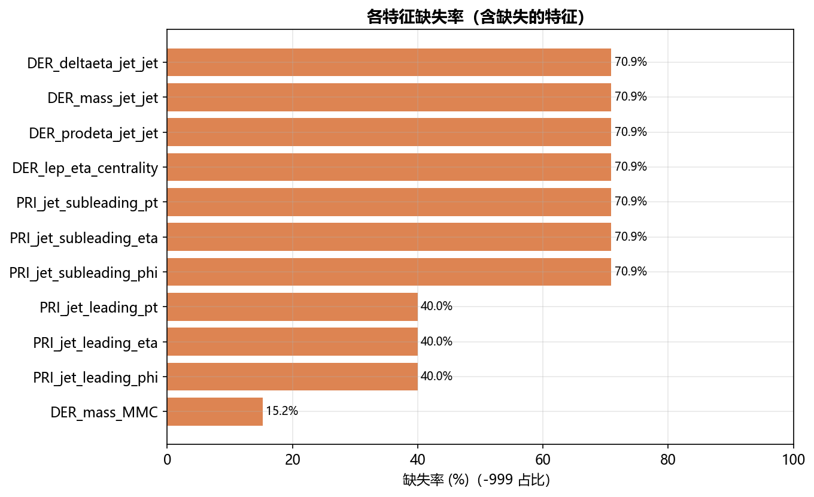
     
    <em>各特征缺失率</em>

数据用 -999 表示缺失，分两类来源：
- **结构性缺失**：当 `PRI_jet_num < 2` 时，喷注相关量（如 `DER_deltaeta_jet_jet`、
  `PRI_jet_subleading_*`）物理上不存在，缺失率约 71%；`PRI_jet_leading_*` 约 40%。
- **重建失败缺失**：`DER_mass_MMC` 约 15.2%，表示质量重建失败。

注意到缺失模式由 `PRI_jet_num` 决定，“缺失”本身携带物理信息，这启发我们在 §3 中对树模型保留 -999、对线性模型加入 Missing Indicator。

### 2.3 喷注拓扑分析

    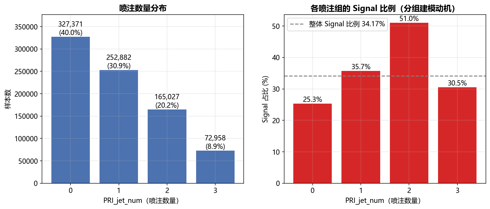
     
    <em>喷注拓扑分析</em>

不同 `PRI_jet_num` 组的 Signal 比例差异显著：
| jet 数 | 占比  | Signal 占比 |
| ------ | ----- | ----------- |
| 0      | 40.0% | 25.3%       |
| 1      | 30.9% | 35.7%       |
| 2      | 20.2% | **51.0%**   |
| 3      | 8.9%  | 30.5%       |

这提示按喷注分组建可能有益，催生了 §9 的创新实验。

### 2.4 PCA 降维分析

    

        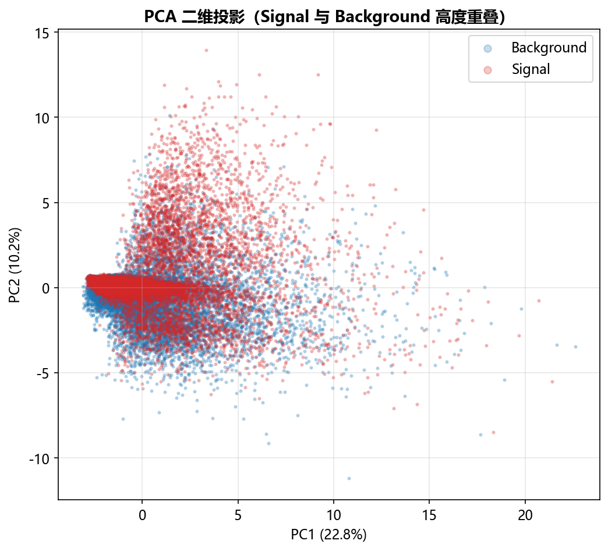
         
        <em>PCA 二维投影</em>
    

    

        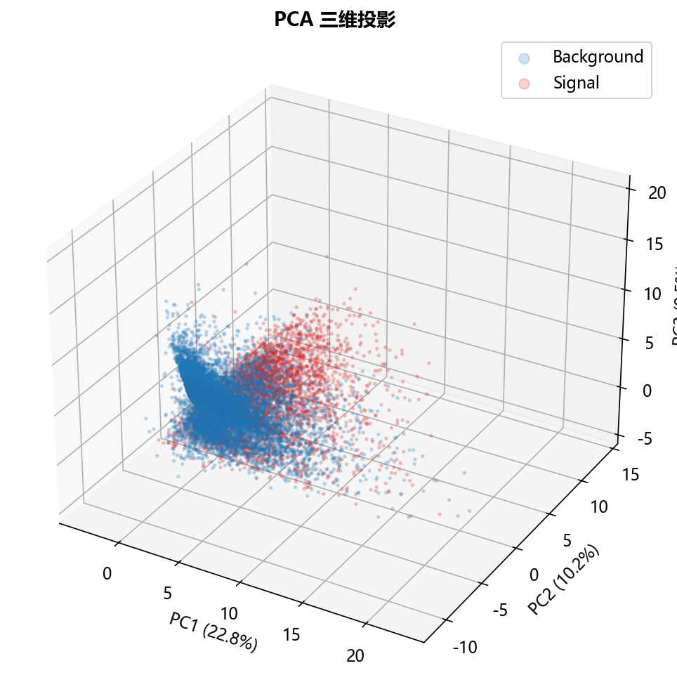
         
        <em>PCA 三维投影</em>
    

对标准化后的 30 维特征做 PCA：前 3 个主成分累计解释方差仅 **41.4%**，且二维和三维投影中，Signal 与 Background 高度重叠。这从经验上证明问题具有强非线性结构，为采用随机森林、XGBoost、MLP 等非线性模型提供了直接依据。

### 2.5 相关性分析

    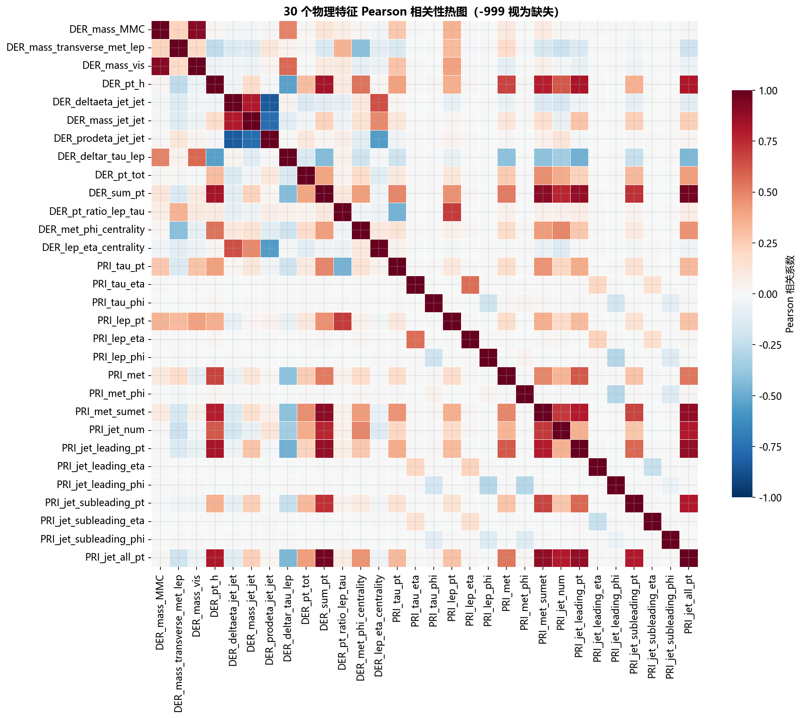
     
    <em>30 个训练特征的相关性热力图</em>

    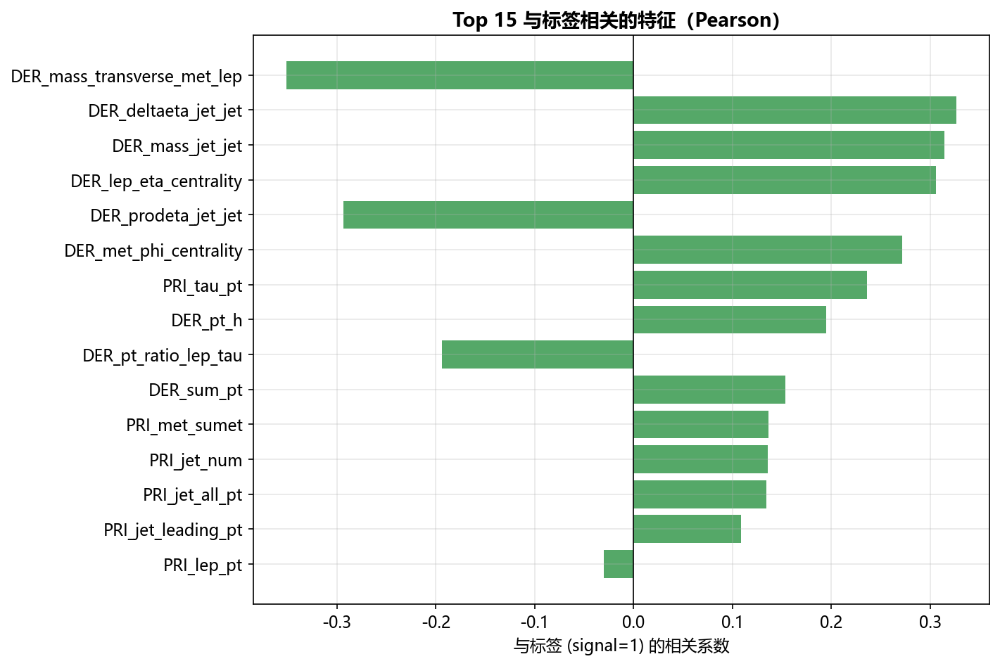
     
    <em>前 15 的特征与标签的相关性</em>

Pearson/Spearman 分析显示，与标签相关性最高的特征为质量类高阶量（`DER_mass_MMC`、`DER_mass_transverse_met_lep`、`DER_mass_vis`），与后续 SHAP 结论一致。

---

## 3. 数据预处理

针对不同模型族设计两套方案，实现代码见 `src/preprocessing.py`。

### 3.1 树模型方案（Random Forest / XGBoost）
**保留 -999**。XGBoost 通过 `missing=-999` 原生学习每个分裂的最优缺失方向；树模型可直接把“是否缺失”作为分裂依据，从而利用结构性缺失信息。

### 3.2 线性 / 神经网络方案（Logistic Regression / MLP）
-999 对线性模型是灾难性异常值，构建如下流水线：
1. **中位数填充**（用训练集统计量，防泄漏）；
2. **Missing Indicator**：为 11 个含缺失特征新增 0/1 指示列；
3. **PRI_jet_num One-Hot** → `jet_0..jet_3`；
4. **StandardScaler** 标准化连续特征。

输出维度：基础 33 列（29 连续 + 4 one-hot），加指示列后 44 列。

### 3.3 A/B 对照
研究问题：缺失信息是否携带分类信息。  
预处理模块支持 `add_missing_indicator` 开关，可对比有/无指示列对 AUC/AMS 的影响。

---

## 4. 建模方法与训练

统一封装于 `src/models.py`:
- 模型工厂；
- sklearn Pipeline；
- 训练评估接口。

### 4.1 基准模型
参见 `outputs/reports/baseline_metrics.csv`，下表是其中部分指标的近似结果。
| 模型               | Accuracy | ROC-AUC | AMS(best) | 说明           |
| ------------------ | -------- | ------- | --------- | -------------- |
| 多数类基准 (Dummy) | 0.660    | 0.500   | 1.079     | 绝对下限       |
| 逻辑回归           | 0.752    | 0.815   | 2.044     | 线性可分性上限 |

### 4.2 候选模型与选择理由
- **XGBoost**（Boosting 集成，主模型）：表格数据的业界 SOTA，原生支持缺失值，正则化强、可调空间大。
- **逻辑回归**：可解释线性基线，衡量线性可分程度。
- **随机森林**（Bagging 集成）：天然处理非线性与缺失，方差低、稳健。
- **MLP**（神经网络）：通用函数逼近器，验证深度模型在该结构化任务上的表现并与树模型对比。

---

## 5. 超参数优化与交叉验证
系统化调优而非人工试参，实现代码见 `scripts/04_hyperparameter_tuning.py`。

1. 使用 RandomizedSearchCV 随机采样 30 组超参数组合，搭配3折交叉验证，以 ROC‑AUC 作为评分标准，快速定位高性能区域。
2. 在最优参数附近，采用 GridSearchCV 配合5折交叉验证进行局部精细搜索。
3. 通过5折交叉验证报告模型性能的均值和标准差，评估其稳定性。
4. 绘制学习曲线与验证曲线，诊断模型的偏差与方差状态。  

结果：
- 最优超参数：`max_depth=9`, `learning_rate=0.0284`, `n_estimators=592`,
`subsample=0.855`, `colsample_bytree=0.732`, `min_child_weight=8`, `reg_lambda=3.65`。
- 5 折 CV ROC-AUC = 0.9127 ± 0.0009，标准差极小，泛化稳定。

    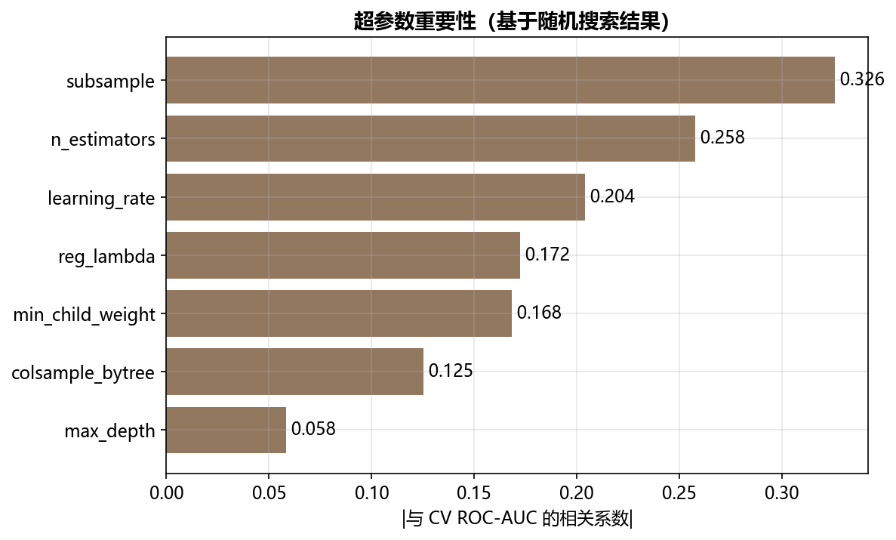
     
    <em>超参数重要性</em>

由 `subsample > n_estimators > learning_rate` 可知，采样比例与模型容量影响最大。

    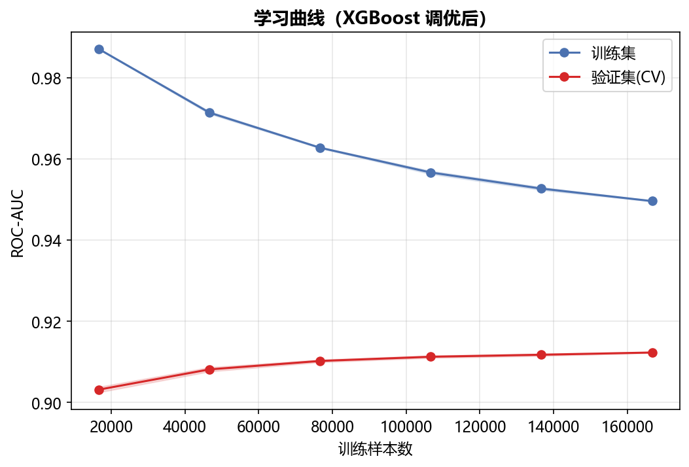
     
    <em>XGB 调优后的学习曲线</em>

学习曲线表明训练过程中未出现明显过拟合。

---

## 6. 模型评估与结果

### 6.1 评估指标选择
由于类别不平衡，因此该分类问题不能只看 Accuracy。本项目报告：
- **AMS**：物理发现显著性；
- **Accuracy / Precision / Recall / F1**：综合刻画分类质量；
- **ROC-AUC**：阈值无关的排序能力。

### 6.2 模型排行榜
以下指标的评估集均为 `public`。

    

        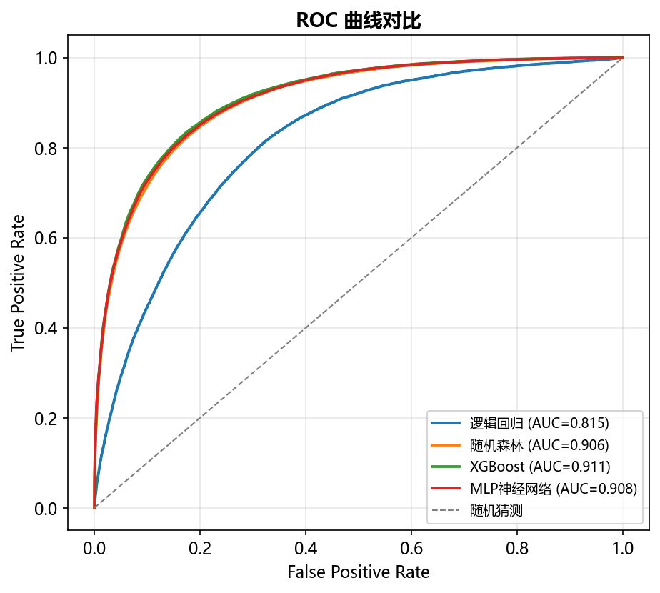
         
        <em>ROC 曲线对比</em>
    

    

        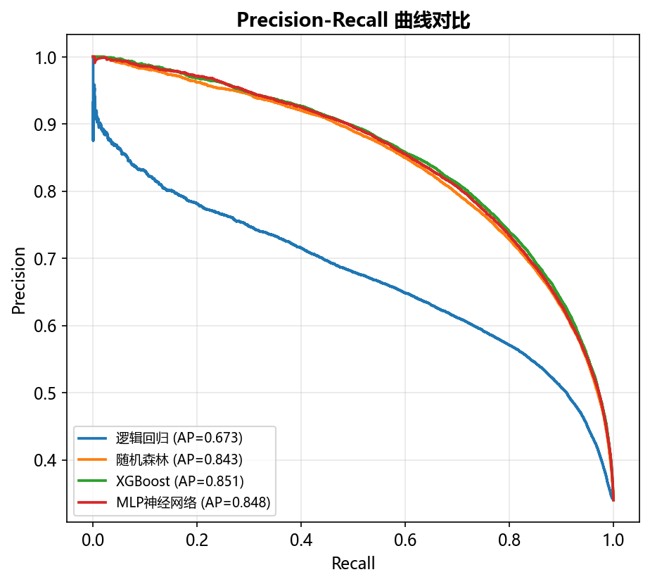
         
        <em>P-R 曲线对比</em>
    

    

    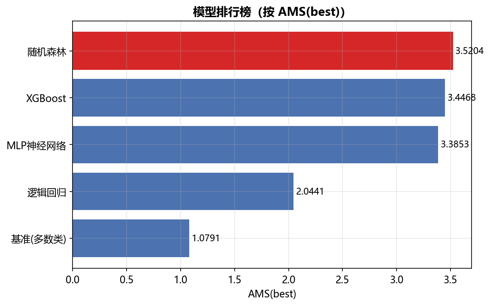
     
    <em>模型排行榜（按 AMS(best)）</em>
    

    

    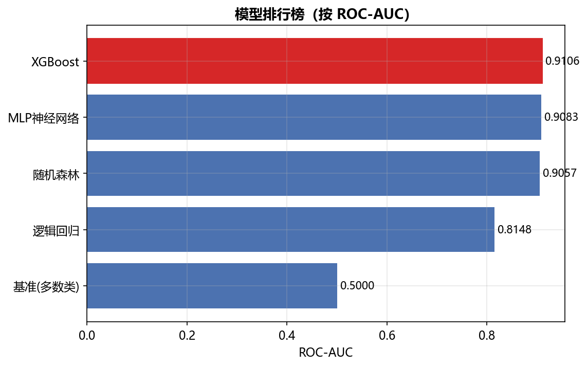
     
    <em>模型排行榜（按 ROC-AUC）</em>
    

    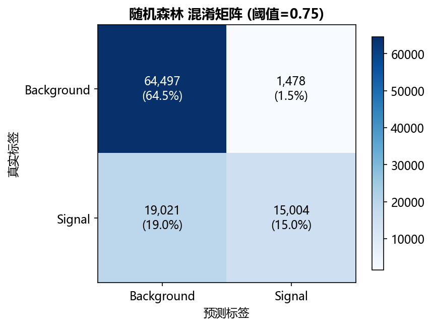
     
    <em>随机森林混淆矩阵</em>

| 模型       | Accuracy | Precision | Recall | F1    | ROC-AUC | AMS(best) |
| ---------- | -------- | --------- | ------ | ----- | ------- | --------- |
| 随机森林   | 0.837    | 0.790     | 0.710  | 0.748 | 0.9057  | 3.520     |
| XGBoost    | 0.843    | 0.789     | 0.735  | 0.761 | 0.9106  | 3.447     |
| MLP        | 0.840    | 0.777     | 0.743  | 0.760 | 0.9083  | 3.385     |
| 逻辑回归   | 0.752    | 0.668     | 0.539  | 0.596 | 0.8148  | 2.044     |
| 多数类基准 | 0.660    | 0.000     | 0.000  | 0.000 | 0.5000  | 1.079     |

三个非线性模型 ROC-AUC 全部近似 0.91，显著超过线性基线的 0.815，印证了此前的非线性判断。

### 6.3 主模型最终结果
仅在 private 评估一次。
调优后 XGBoost，在 public 上选定阈值为 0.840，在 private 上：
- ROC-AUC = 0.9131
- AMS = 3.5959

### 6.4 阈值与 AMS

    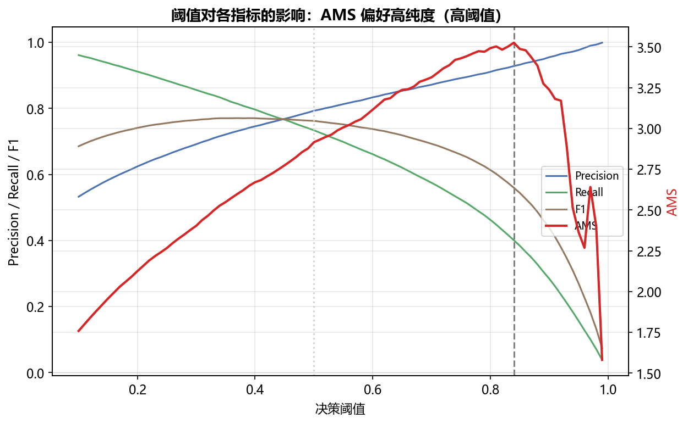
     
    <em>阈值对各指标的影响</em>

Threshold–AMS 曲线在 0.84 处取得峰值。此时 $Precision≈0.93$、$Recall≈0.40$——AMS 偏好高纯度选择，这解释了为什么物理发现的最优阈值远高于直觉的 0.5，也说明了为什么仅用 Accuracy 或 F1 评价会得出错误的结论。

---

## 7. 可解释性分析
用 XGBoost 原生 TreeSHAP，兼容 xgboost 3.x，实现代码见 `scripts/07_shap_analysis.py`。

### 7.1 全局解释

    

    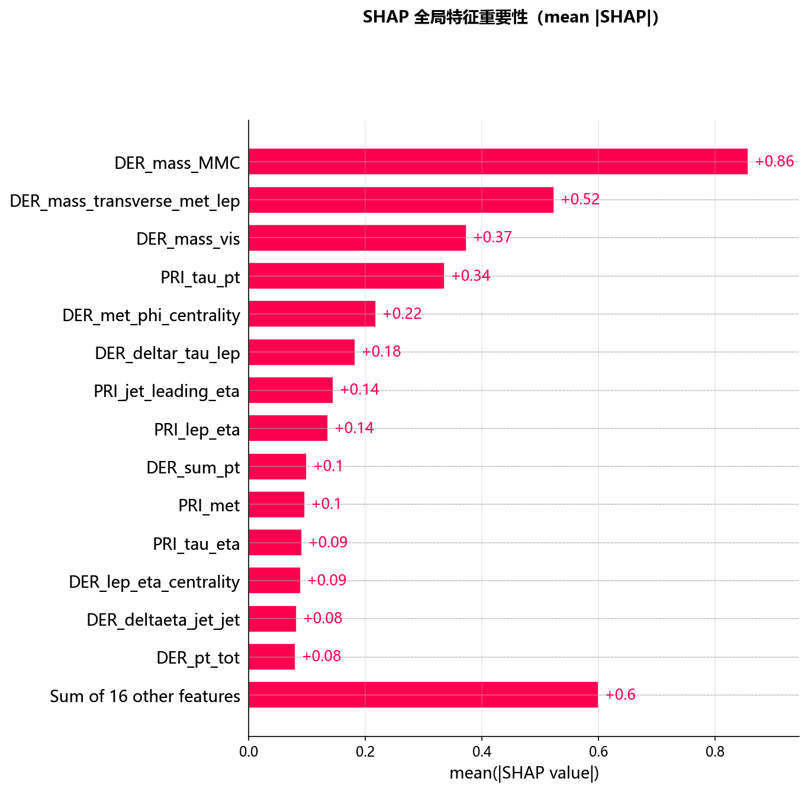
     
    <em>SHAP 全局特征重要性</em>
    

    

    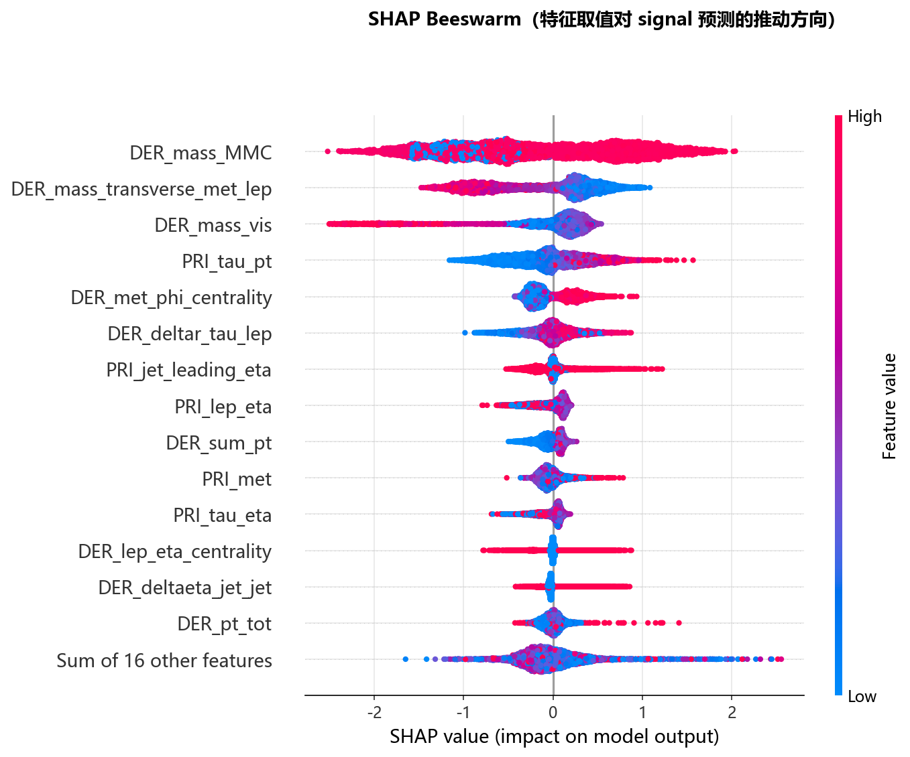
     
    <em>SHAP beeswarm</em>
    

特征重要性：`DER_mass_MMC` ≫ `DER_mass_transverse_met_lep` > `DER_mass_vis` > `PRI_tau_pt`。最重要的是希格斯质量估计量 `DER_mass_MMC`，且 beeswarm 显示其高值推动 Signal 预测——
模型学到的规律与“希格斯通过不变质量峰识别”的真实物理高度一致，增强了可信度。  
DER_mass_MMC(Missing Mass Calculator)被用于在 H→ττ 衰变中重建希格斯玻色子的质量。由于衰变产生的 τ 轻子会进一步衰变成无法探测的中微子，导致能量“缺失”，因此无法直接计算质量。MMC 通过扫描所有可能的运动学配置，并结合 τ 衰变的概率知识进行加权，最终给出最可能的候选质量估计值。对于 H→ττ 信号事件，其重建质量应集中在希格斯玻色子的已知质量（约 125 GeV）附近，而背景过程的峰值则在约 91 GeV 处，这使得该特征成为区分信号与背景最关键的物理变量。

### 7.2 局部解释与错误案例
对单个事件用 waterfall 图解释预测，并分析 FP 和 FN 的均值 SHAP 驱动特征，定位模型犯错的主要原因（如 `PRI_jet_leading_eta`、横向质量等把背景事件误推向 signal）。

    

    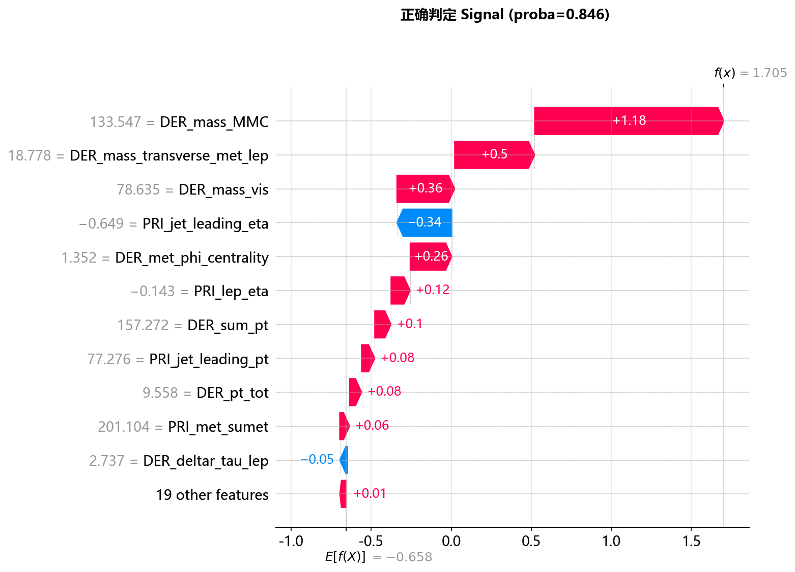
     
    <em>正确判定为 Signal（TP）</em>
    

    

    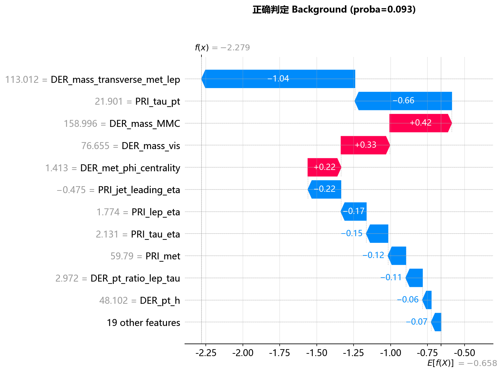
     
    <em>正确判定为 Background（TN）</em>
    

    

    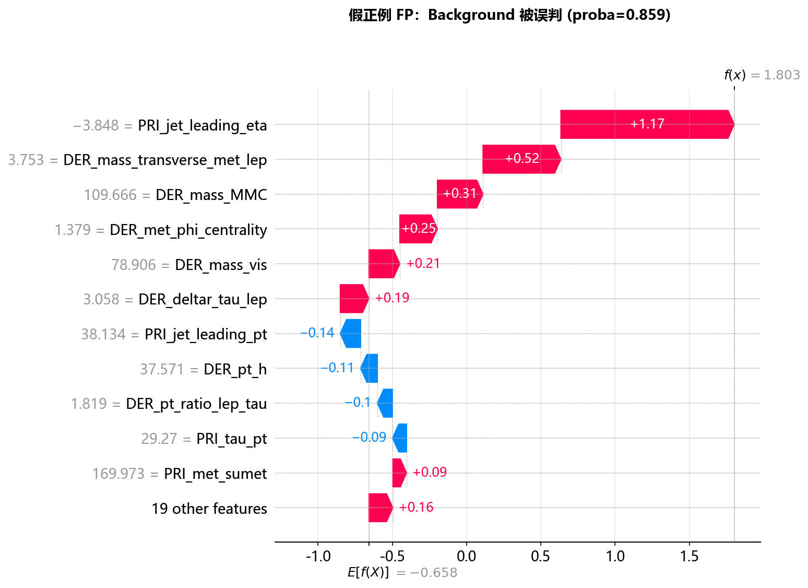
     
    <em>错误判定为 Signal（FP）</em>
    

    

    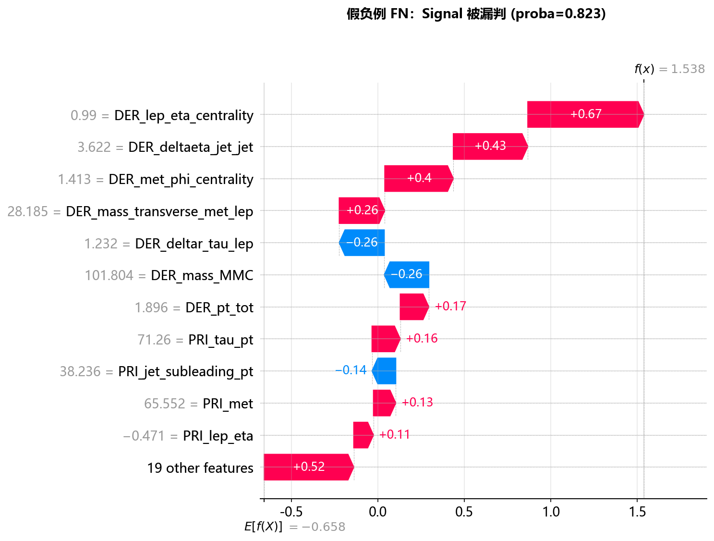
     
    <em>错误判定为 Background（FN）</em>
    

    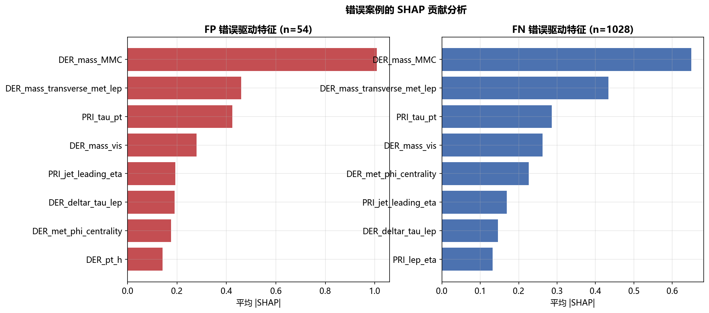
     
    <em>错误案例的SHAP贡献分析</em>

---

## 8. 可信机器学习
实现代码：`scripts/08_robustness.py`。

### 8.1 鲁棒性

    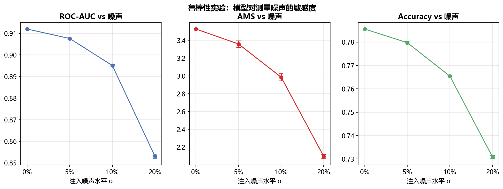
     
    <em>模型对测量噪声的敏感度</em>

对评估特征注入相对高斯噪声，从而模拟探测器误差：
| 噪声 σ | ROC-AUC | AMS   |
| ------ | ------- | ----- |
| 0%     | 0.912   | 3.526 |
| 5%     | 0.908   | 3.358 |
| 10%    | 0.895   | 2.986 |
| 20%    | 0.853   | 2.096 |

小噪声下性能小幅退化；但 AMS 对噪声比 AUC 更敏感，是部署时需要关注的风险点。

### 8.2 稳定性

    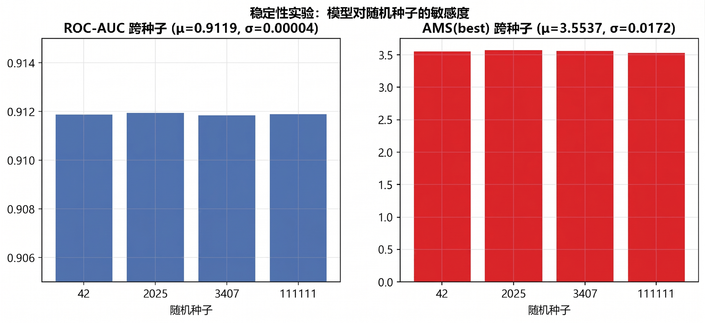
     
    <em>模型对随机种子的敏感度</em>

使用 4 个随机种子 $\{42, 2025, 3407, 111111\}$ 重训，结果：ROC-AUC $μ=0.9119$，$σ=0.00004$；AMS(best) $μ≈3.554$。模型对随机性几乎不敏感。

---

## 9. 创新实验：Jet 分组建模

代码：`scripts/05_jet_grouped.py`。基于 §2.3 的拓扑差异，对比：
- 方案 A：单个 XGBoost 全量训练；
- 方案 B：按 $jet \in \{0,1,2,3\}$ 训练 4 个专家模型，合并预测。

| 方案   | ROC-AUC | AMS(best) |
| ------ | ------- | --------- |
| A 全量 | 0.9119  | 3.549     |
| B 分组 | 0.9105  | 3.509     |

结论：分组未带来提升，反而略降。  
原因：XGBoost 已能通过对 `PRI_jet_num` 与缺失模式分裂，隐式学到喷注拓扑结构；显式分组只是减少了每个子模型的训练样本。这一对照实验体现了“先提假设、再用实验客观验证”的科学方法。  
这促使我们在 §10 中转向真正有效的 AMS 提升路线。

---

## 10. AMS 提升实验：物理权重训练与集成

代码：`scripts/09_ams_boost.py`。§9 表明仅调整建模粒度无法提升 AMS，本节探索更有效的提升路线。

### 10.1 关键思路
- **物理权重训练**：AMS 是加权指标，但标准训练对所有样本等权。我们把官方事件权重 `KaggleWeight` 作为 `sample_weight`，并做类别平衡（令 Signal 与 Background 的权重总和相等），使训练目标从“区分单个样本”转向“优化加权显著性”，直接对齐 AMS。
- **CV-Bagging**：用 5 折分别训练 XGBoost 并对预测取平均，降低单模型方差。
- **异质集成**：融合 XGBoost / 随机森林 / MLP 的预测（概率均值、排名均值、凸组合），利用模型多样性。

### 10.2 结果

    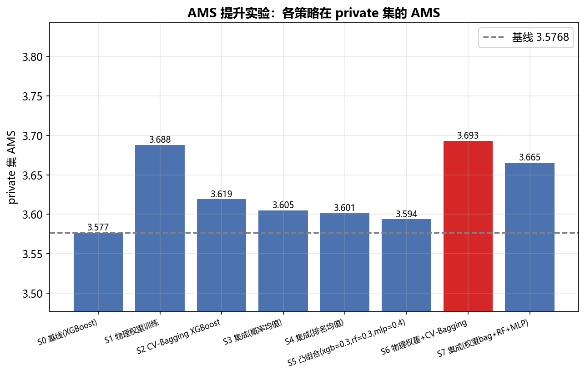
     
    <em>各策略在 private 集的 AMS</em>

| 策略                          | public AMS | private AMS | private AUC | Δ(private) |
| ----------------------------- | ---------- | ----------- | ----------- | ---------- |
| S0 基线（单 XGBoost）         | 3.549      | 3.577       | 0.9131      | —          |
| S1 物理权重训练               | 3.692      | 3.688       | 0.9033      | +0.111     |
| S2 CV-Bagging                 | 3.563      | 3.619       | 0.9134      | +0.042     |
| S3 集成（概率均值）           | 3.570      | 3.605       | 0.9133      | +0.028     |
| S4 集成（排名均值）           | 3.565      | 3.601       | 0.9134      | +0.024     |
| S5 凸组合                     | 3.583      | 3.594       | 0.9134      | +0.017     |
| **S6 物理权重 + CV-Bagging**  | **3.706**  | **3.693**   | 0.9037      | **+0.116** |
| S7 集成（权重bag + RF + MLP） | 3.661      | 3.665       | 0.9118      | +0.089     |

### 10.3 分析与洞察
- **最优策略 S6（物理权重 + CV-Bagging）** 将 private 集的 AMS 从 3.58 提升到 3.69，兼得了权重训练的 AMS 增益与 Bagging 的方差缩减，是本项目的最佳结果。
- **AMS 与 AUC 的权衡**：物理权重训练让 AMS 显著上升，但 AUC 反而略降（0.913→0.904）。这说明 AUC（整体排序能力）与 AMS（信号富集区的发现显著性）并非同一目标——当训练聚焦于加权显著性时，模型在高分纯度区更“用力”，牺牲了部分全局排序。这进一步印证了 §6.1“评估指标必须与任务目标对齐”的观点。
- 若需同时兼顾排序与显著性，S7（AMS 3.665 / AUC 0.912）是更均衡的折中方案。

### 10.4 最终模型的阈值–指标关系
对最终模型（物理权重 + CV-Bagging）在 public 集上重新扫描决策阈值，得到与 §6.4 同形式的曲线：

    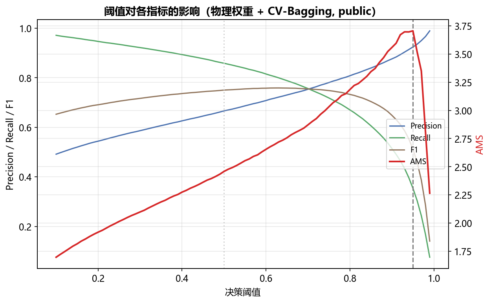
     
    <em>最终模型：阈值对 Precision / Recall / F1 / AMS 的影响（public）</em>

在 public 集上，AMS 于 阈值 0.95 处取得峰值 3.706；用该阈值在 private 集上的 AMS 为 3.69，即本项目对外汇报的最终成绩。  
与 §6.4 相比，最优阈值进一步右移：物理权重训练放大了信号富集区的得分，使得只有把阈值抬到极高纯度时才达到显著性峰值——这与 §10.3 的 “AMS 偏好高纯度” 结论一致。

---

## 11. 交互式系统
1. **项目介绍**：背景、数据集、AMS 指标公式与含义、模型排行榜。
2. **碰撞事件可视化**：基于 $φ/pT$ 的横向平面事件可视化。注意这只是解释性示意，非真实重建。
3. **实时预测**：最终模型的 Signal 概率仪表盘 + 可拖动决策阈值（默认 AMS 最优 0.95）+ 预测/真实标签对照。
4. **SHAP 解释**：当前事件的特征贡献条形图（最终集成各成员模型的平均 SHAP）。
5. **AMS 实验室**：基于最终模型，拖动阈值实时更新 Precision/Recall/F1/AMS。
6. **模型比较**：交互式 ROC 曲线、PR 曲线、混淆矩阵、排行榜（含最终模型）。

---

## 12. 结论、局限性与改进方向

### 12.1 结论
- 构建了完整的希格斯信号识别机器学习系统，主模型 XGBoost 在独立 private 集达到
  ROC-AUC 0.913、AMS 3.60，显著优于线性基线，且跨种子极其稳定；进一步通过物理权重训练 + CV-Bagging 将 private AMS 提升至 3.69。
- 通过 AMS 阈值优化、SHAP 可解释性、鲁棒性分析，实现了“可发现、可解释、可信”的闭环。
- SHAP 结论与真实物理一致，模型学到的是物理规律而非伪相关。

### 12.2 局限性
1. **类别不平衡与不确定性**：未显式建模权重不平衡与系统误差；AMS 对噪声较敏感。
2. **过拟合风险可控但存在**：训练集与验证差距虽小，深树 `max_depth=9` 仍有一定方差。
3. **数据偏见**：数据来自蒙特卡洛模拟，与真实探测器数据可能存在分布偏移。
4. **特征工程有限**：主要使用官方提供特征，未引入物理领域的新构造量。

### 12.3 改进方向
1. **概率校准**（Platt / Isotonic）以获得更可靠的概率与更稳的阈值。
2. **物理启发特征工程**（如不变质量组合、角度差），并在真实数据上做域适应。
3. **代价敏感 / 自定义 AMS 目标函数 / Focal Loss**，从损失层面进一步对齐 AMS。
4. **不确定性量化**（如深度集成、贝叶斯方法）评估每条预测的置信度。

---

## 13. 课程知识覆盖与团队分工

### 13.1 课程知识覆盖
线性分类（逻辑回归）、PCA 降维、集成学习（随机森林 / XGBoost / Bagging / Stacking）、神经网络（MLP）、交叉验证与超参数搜索、模型评估、可解释机器学习（SHAP）、可信机器学习（鲁棒性）、数据可视化、机器学习系统开发。

### 13.2 创新点小结
1. 面向物理发现的 **AMS 优化** 而非单纯 Accuracy。
2. **Jet 分组建模** 对照实验。
3. **物理权重训练 + CV-Bagging**：将 private AMS 从 3.58 提升到 3.69。
4. **SHAP** 全局/局部可解释 + 错误案例分析。
5. **MADAI 风格 Event Display** 交互可视化。
6. **可信机器学习**：噪声鲁棒性 + 多种子稳定性。
7. **PCA** 降维结构分析支撑模型选择。

### 13.3 团队分工
数据探查与处理、建模与调优、可解释性与可信性、系统开发、报告与答辩。  
使用 Git 进行版本管理。